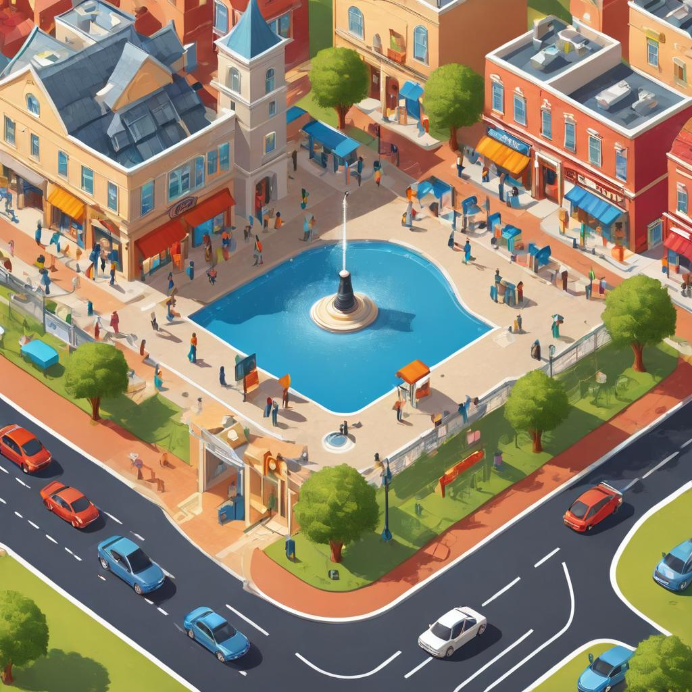

### **Exploring the Web: Behind the Scenes of Your Browser**

#### **Developmental Outcome**
By the end of this lesson, learners will:
1. Understand how the Web operates, including basic communication between web systems.
2. Learn key terms such as client, server, DNS, HTTP, and TCP/IP.
3. Visualize the flow of data between the client and the server through the HTTP Request-Response Cycle.
4. Recognize the Web’s role in addressing modern challenges like accessibility and global communication.
5. Understand the roles of frontend and backend in web development and how they connect to Web Fundamentals.

---

#### **Introduction: The Web as a Digital World**



Imagine stepping into a digital city, where each website is a building, and the web is the network of roads and communication systems connecting everything. In this city, every user, every webpage, and every server plays a key role in keeping everything functioning smoothly. As a user, you interact with the websites (the buildings), but behind the scenes, there’s a lot more happening to make sure you can visit and access these sites. 

In this lesson, we’ll explore how this "digital city" works, the roles of different components, and how they interact to provide you with the seamless experience you enjoy while browsing the internet.

The web functions like a dynamic city, where each part serves a specific purpose:

- **The Client (You):** Just as a person enters a shop in a city to make a request, the **client** (your browser) requests resources from a website.  
- **The Server (The Shopkeeper):** The **server** is like the shopkeeper who retrieves or prepares what you need. It stores and sends the requested information to the client.
- **DNS (Domain Name System):** Think of it as a directory or map of the city that helps you locate the correct building (server) you want to visit. Without it, finding addresses would be like wandering without a map.
- **HTTP/HTTPS (The Protocols):** This is the language used between the client and server, just as you’d need to know the language to communicate with a shopkeeper.
- **TCP/IP (The Roads and Transport):** These are the networks or "roads" that deliver your request and the server’s response, ensuring that the data travels safely from one place to another.

---

##### **Illustration: The Web as a Digital City**

Here’s a simplified view of how data flows in the web "city":

```plaintext
[You (Client)] -- Request --> [City Map (DNS)]  
 ↳ Finds "Address" of Shop (Server)  
[Shopkeeper (Server)] -- Response --> [You (Client)]  
```

Steps:
1. **You (Client)** search for a shop (website) using the map (DNS).
2. You make a request (e.g., asking for a product).
3. The **shopkeeper (Server)** finds the requested item and sends it back.
4. **You (Client)** receive and use the item (data displayed in the browser).

---

#### **What the Web Solves in Today’s Scenario**

In today’s interconnected world, the web functions as a global community solving various challenges:

1. **Accessibility:**  
   - Problem: Difficulty accessing information or resources.  
   - Solution: Provides free, instant access to global knowledge and tools.

2. **Communication:**  
   - Problem: Delayed or limited communication.  
   - Solution: Enables real-time messaging, video calls, and collaboration.

3. **Convenience:**  
   - Problem: Inefficiency in accessing services like shopping or banking.  
   - Solution: Facilitates online transactions and services anytime, anywhere.

4. **Global Connectivity:**  
   - Problem: Lack of integration between different systems and devices.  
   - Solution: Links diverse devices, enabling seamless data sharing (e.g., IoT).

5. **Empowerment:**  
   - Problem: Limited opportunities for learning and growth.  
   - Solution: Democratizes education and skill development through online platforms.

---

#### **Frontend vs Backend: Understanding the Key Web Components**

In web development, the **frontend** and **backend** are like two different parts of a website, each with a distinct role but deeply connected:

- **Frontend:**  
   - The **frontend** is the part of the website that users directly interact with—the design, layout, and functionality you see and use. It's everything that makes a website appealing and user-friendly.
   - Technologies involved: HTML, CSS, JavaScript.
   - Example: When you visit a website, the images, text, and interactive buttons you see on the page are part of the **frontend**.

- **Backend:**  
   - The **backend** handles all the behind-the-scenes activities, such as managing databases, server requests, and ensuring that everything you see on the frontend functions properly.
   - Technologies involved: Server-side languages (e.g., PHP, Node.js, Python), databases (e.g., MySQL, MongoDB).
   - Example: When you log into a website, the **backend** checks your credentials, retrieves your data from a database, and ensures you're granted access.

**How They Connect to Web Fundamentals:**  
- **Frontend**: Built using **Web Fundamentals** (HTML, CSS, and JavaScript), the **frontend** ensures the structure, appearance, and interactivity of the website.
- **Backend**: The **backend** ensures that dynamic functionality, such as user logins, data storage, and content management, works seamlessly.

---

#### **How the Web Works: Key Concepts**

1. **Client-Server Relationship:**  
   The client (browser) requests resources, and the server delivers them.

2. **DNS (Domain Name System):**  
   Translates user-friendly domain names into IP addresses.

3. **HTTP/HTTPS:**  
   Defines how messages are sent and received securely.

4. **TCP/IP:**  
   Ensures data packets travel safely and reliably to their destinations.

---

#### **The HTTP Request-Response Cycle**

When you access a website:
1. **Request:** Your browser sends an HTTP request for specific resources.
2. **Processing:** The server retrieves and processes the requested data.
3. **Response:** The server sends the data (e.g., HTML, CSS).
4. **Rendering:** Your browser displays the website on your screen.

---

#### **Key Takeaways**

- The Web works like a dynamic digital city where clients (users) and servers interact.
- **Frontend** is what you see and interact with on a webpage, while **backend** powers the functionality behind it.
- DNS, HTTP/HTTPS, and TCP/IP enable smooth and secure communication across the web.
- The web addresses modern challenges like accessibility, communication, and global connectivity.
