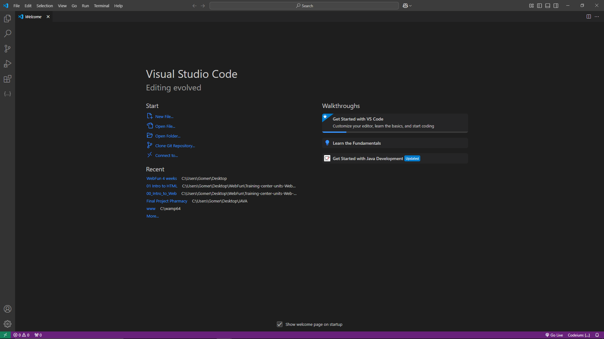

### **Tools and Setup (What we need)**

#### **Developmental Outcome**
By the end of this lesson, learners will:
1. Understand how to set up and effectively use essential tools for web development.
2. Be familiar with the role of a code editor, browser, and developer tools in the web development workflow.
3. Configure their workspace for an efficient and productive coding experience.

---

#### **Setting Up Your Web Development Tools**

Imagine starting a project without the right tools. For web development, your **code editor**, **browser**, and **developer tools** are your essential instruments, each playing a crucial role in creating, testing, and refining your web projects.

1. **Code Editor: Your Workspace for Writing Code**

The **code editor** is where you’ll write and organize your code. It’s like the desk where you draft your blueprints.

**Recommended Tool: VS Code (Visual Studio Code)**

VS Code is one of the most popular and free code editors for web development. It helps you write clean, structured code with features like syntax highlighting, auto-completion, and built-in debugging.

**Installation Steps for VS Code:**
1. Visit [VS Code's download page](https://code.visualstudio.com/).
2. Download the appropriate version for your operating system (Windows, Mac, Linux).
3. Follow the installation instructions, and launch VS Code once installed.

**Essential Extensions to Install in VS Code:**
- **HTML Snippets**: Provides shortcuts for writing HTML elements quickly.
- **Live Server**: Automatically refreshes your browser as you make changes to your code, offering a real-time preview of your webpage.
- **Prettier**: Formats your code consistently, improving readability.

---

2. **Browsers: Testing and Viewing Your Code**

Browsers are the “viewers” of your web projects, where you can test and see how your website looks and behaves. Each browser may display your site slightly differently, so it’s essential to test across multiple platforms.

**Recommended Browser: Google Chrome**

Google Chrome is a popular choice for web development due to its developer-friendly features and consistent rendering of websites.

**Why Google Chrome?**
- **Built-in Developer Tools**: Chrome comes with powerful tools for inspecting and debugging your HTML, CSS, and JavaScript in real-time.
- **Incognito Mode**: Allows you to view your webpage without cached data, ensuring you're seeing the latest version of your site.

---

3. **Developer Tools: Inspecting, Debugging, and Optimizing Your Code**

Developer tools (DevTools) are built directly into browsers like Chrome and give you the ability to inspect, debug, and improve your code while it’s running on your website.

**How to Access Developer Tools in Chrome:**
1. Open Chrome and navigate to any webpage or the one you're working on.
2. Right-click anywhere on the page and select **Inspect** (or press `Ctrl + Shift + I` on Windows or `Cmd + Option + I` on Mac).
3. The **Elements** tab will show you the structure of your webpage, where you can inspect and edit HTML directly.
4. The **Console** tab lets you see error messages or log information from your JavaScript code, helping you debug any issues.

---

#### **What These Tools Solve:**

- **Code Editor**: Provides a clean workspace to write and organize code, improving productivity and accuracy.
- **Browsers**: Display your website so you can test and experience it as users would, ensuring functionality and performance across platforms.
- **Developer Tools**: Help you troubleshoot issues, optimize your site’s performance, and understand how browsers interpret your code.

---

#### **Key Takeaways**
- **Code Editor (VS Code)**: The space where you write and structure your code.
- **Browsers (Chrome)**: Where you test and view your website, ensuring it's functioning as expected.
- **Developer Tools**: Essential for debugging and improving your code in real-time.

With these tools set up, you’re now ready to dive into web development with a solid foundation for writing, testing, and refining your code.