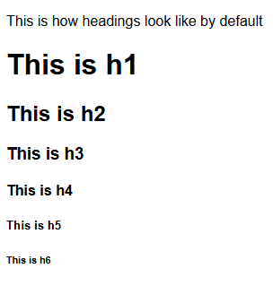

### **Common Tags: Building the Foundations of Web Content**

#### **Developmental Outcome**  
By the end of this lesson, learners will:  
1. Understand the purpose and usage of key HTML tags such as `<h1>`, `<p>`, `<a>`, ``, and `<div>`.  
2. Recognize the importance of proper tagging for accessibility and SEO.  
3. Be able to apply these tags to create meaningful, accessible, and well-structured web content.

---

#### **The Web’s Building Blocks**  
Building a webpage is like crafting a well-organized book. Without chapters, paragraphs, or titles, the content would be a jumbled mess, hard to follow or understand. HTML tags serve as the table of contents, section headers, and pages of your website, giving it structure and clarity. Just as a book relies on these elements to guide readers through its narrative, a webpage depends on HTML tags like headings, paragraphs, links, and images to make the content accessible and easy to navigate. In this lesson, we’ll explore these fundamental tags and how they work together to form a cohesive webpage.

---

#### **Headings: Structuring Content with Purpose**  
Headings define the structure and hierarchy of your content, helping users and search engines understand it better. HTML provides six levels of headings, from `<h1>` (the most important) to `<h6>` (the least important).  

##### **Example Usage**  
```html
<h1>Welcome to My Website</h1>
<h2>About Me</h2>
<h3>Hobbies and Interests</h3>
```



**Explanation:**  
- `<h1>` serves as the main title of the page, typically used once.  
- `<h2>` and `<h3>` break content into sections and subsections, providing a logical flow.  

**Why It Matters:**  
1. **Accessibility:** Screen readers use headings to help visually impaired users navigate content efficiently.  
2. **SEO:** Search engines prioritize well-structured pages, boosting visibility and ranking.  
3. **User Experience:** Proper headings make content scannable, improving engagement.  

---

#### **Paragraphs: Delivering Your Message**  
The `<p>` tag is used to create paragraphs, grouping sentences into logical units of information.  

##### **Example Usage**  
```html
<p>HTML paragraphs are used to structure text content, making it easier to read and understand.</p>
```

**Explanation:**  
- Text inside a `<p>` tag is displayed as a block of text with proper spacing.  
- Use paragraphs to organize your thoughts clearly and concisely.  

---

#### **Links: Connecting the Web**  
Links, created using the `<a>` tag, allow users to navigate between webpages or resources.  

##### **Example Usage**  
```html
<a href="https://www.example.com">Learn More</a>
```

**Explanation:**  
- The `href` attribute specifies the URL of the destination.  
- Link text should be descriptive to provide context and enhance accessibility.  

**Best Practices:**  
- Use meaningful text for links (e.g., "Learn More" instead of "Click Here").  
- Open external links in a new tab using `target="_blank"` if appropriate.

---

#### **Images: Adding Visual Context**  
The `` tag displays images on a webpage and includes attributes like `src` for the file path and `alt` for alternative text.  

##### **Example Usage**  
```html

```

**Explanation:**  
- The `src` attribute specifies the image’s location.  
- The `alt` attribute describes the image, crucial for accessibility.  

**How to Add Image Sources:**  
1. **Using a URL:** If the image is hosted online, provide the full URL:  
   ```html
   
   ```
2. **Using a Local Folder:** If the image is saved in the same directory as your HTML file, simply use the filename:  
   ```html
   
   ```
3. **Using a Subfolder:** If the image is inside a subfolder, specify the folder path:  
   ```html
   
   ```
4. **Going Up a Directory:** If the image is in a parent folder, use `../` to navigate up:  
   ```html
   
   ```

**Why the `alt` Attribute Matters:**  
1. **Accessibility:** Screen readers narrate the `alt` text for visually impaired users.  
2. **SEO:** Search engines use `alt` text to understand an image's content, improving page rankings.  
3. **Fallback:** When an image fails to load, the `alt` text ensures the user still gets context.

---

#### **Div: A Versatile but Cautious Wrapper**  
The `<div>` tag is a container used to group elements together, often for styling or layout purposes. While useful, `<div>` should be used sparingly to avoid unnecessary complexity and maintain semantic clarity. 

##### **Example Usage**  
```html
<div class="content-box">
    <h2>My Blog</h2>
    <p>Welcome to my blog where I share web development tips!</p>
</div>
```

**Explanation:**  
- `<div>` wraps multiple elements, making it easier to apply styles or structure a webpage.  
- By itself, `<div>` has no meaning; it is primarily used with CSS or JavaScript.  

**When to Use `<div>` Sparingly:**  
1. **Favor Semantic Tags:** Instead of `<div>`, use `<section>`, `<article>`, `<header>`, or `<footer>` when possible.  
2. **Avoid Div Soup:** Overusing `<div>` without meaningful structure can lead to messy, hard-to-maintain code.  
3. **Use It for Styling & Layout:** `<div>` is useful when grouping elements together for CSS styling or JavaScript manipulation.  

---

#### **Key Points**  
- **Headings** create structure and enhance accessibility and SEO.  
- **Paragraphs** group and convey textual information.  
- **Links** connect content across the web and improve navigation.  
- **Images** enhance visual appeal, while `alt` text ensures accessibility and SEO optimization.  
- **Image sources** can be from URLs, local folders, or subdirectories.  
- **Divs** help group elements but should be used sparingly to maintain clean and semantic HTML.

