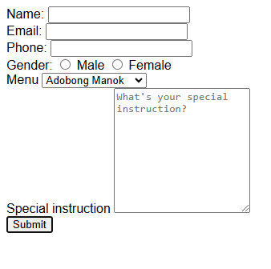

### **Assignment: Creating a Customer Order Form in HTML**

In this assignment, you'll create a simple HTML form to collect customer order information. The form will include input fields for customer details, a selection of gender, a product dropdown, a text area for special instructions, and a submit button.

#### **Estimated Time to Completion:** 1 hour  
#### **Level of Complexity:** Beginner

---

### **Instructions**

1. Follow the directions below carefully to create your form.
2. Ensure that your form contains the required fields and features.
3. Submit your HTML file by the due date.

---

### **Evaluation Criteria & Learning Objectives**

- Demonstrate an understanding of creating forms in HTML.
- Use the appropriate form elements like input fields, radio buttons, dropdowns, and text areas.
- Properly label form elements using `<label>` tags for accessibility.
- Submit a form with all the required input fields and a submit button.

---

### **Directions**

#### **Page Requirements (MVP)**

1. **Document Setup:**
   - Save your file as `lastname_firstname_orderform.html`.
   - Include the `<!DOCTYPE html>` declaration.
   - Include a `<head>` section with a `<title>` tag reflecting the purpose of the page (e.g., "Customer Order Form").

2. **Form Fields:**
   - **Name:** Add a text input field for the customer’s name.
   - **Email:** Add a text input field for the customer’s email address.
   - **Mobile Number:** Add a text input field for the customer’s mobile number.
   
3. **Gender Selection:**
   - Use radio buttons (`<input type="radio">`) to allow the customer to choose their gender. Label the options (e.g., "Male" and "Female").

4. **Product Selection:**
   - Add a dropdown (`<select>`) that allows the customer to choose a product. Provide at least three different product options in the dropdown.

5. **Special Instructions:**
   - Add a text area (`<textarea>`) where the customer can write special instructions for their order.
   - You can use ` ` for this assignment.

6. **Submit Button:**
   - Add a submit button (`<button type="submit">`) to submit the form.

7. **Good Practices:**
   - Ensure all form elements are properly labeled using `<label>` tags.
   - Include comments (`<!-- -->`) to explain the purpose of key sections in your code.

---

#### **Stretch Requirements**
If you want to challenge yourself further, consider adding these features:

1. **Additional Form Fields:**
   - Add a checkbox for the customer to agree to terms and conditions (e.g., "I agree to the terms and conditions").

---

### **Submission Guidelines**

1. Save your completed file as `lastname_firstname_orderform.html`.
2. Submit the file via the designated platform or email it to your instructor with the subject line: "HTML Assignment: Order Form."

---

### **Important Notes**
- Focus on creating well-structured HTML forms without using styling-related tags.
- Ensure all form fields are correctly labeled.
- Avoid using any inline styles or attributes related to appearance.
- Think about accessibility and user experience while building your form.
