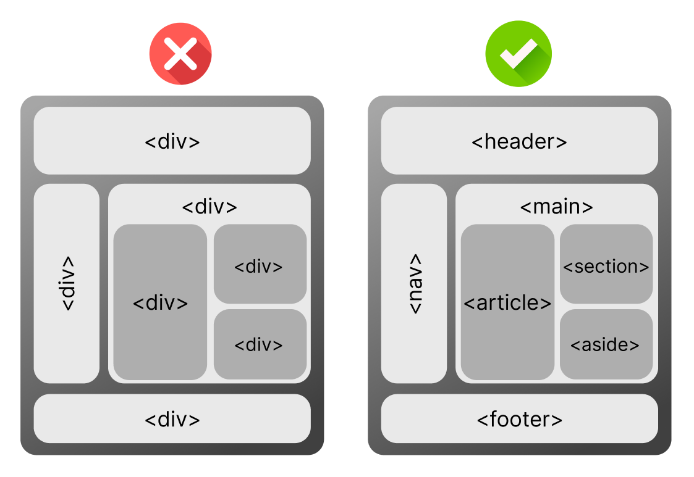

### **Understanding Semantic HTML: Writing Meaningful Code**

#### **Learning Objectives**  
By the end of this lesson, learners will be able to:  

1. Explain the concept of semantic HTML and its importance for accessibility, SEO, and maintainability.  
2. Differentiate between semantic (`<article>`, `<section>`, `<header>`, `<footer>`, etc.) and non-semantic (`<div>`, `<span>`) HTML tags.  
3. Use semantic HTML tags to create well-structured, meaningful, and accessible webpages.

---

#### **Like a Good Book**

Imagine you’re reading a book. A well-written book has clear chapters, headings, and paragraphs that help you understand the story. If the book didn’t have chapters or headings, it would be confusing, and you wouldn’t know where to start or where to find important details.

HTML works the same way. **Semantic HTML** is like writing a book with meaningful structure. It helps both humans and machines (like web browsers) understand the content and its purpose. Just like chapters and headings organize a book, semantic tags organize a webpage.



---

#### **Why Semantic HTML Matters**

##### **What Is Semantic HTML?**

Semantic HTML uses tags that describe the meaning or role of the content inside them. Instead of using general tags like `<div>` or `<span>`, which don’t tell us much about the content, semantic tags describe the purpose of the content. 

**Example of Non-Semantic HTML:**
```html
<div>
  <h2>This is a heading</h2>
  <p>This is some text below the heading.</p>
</div>
```
In this example, the `<div>` tag is used to group the content, but it doesn’t explain what the content is. It’s just a generic container.

##### **Semantic HTML Tags: Making Content Meaningful**

Now let’s see how we can make the same content more meaningful with semantic HTML.

**Example of Semantic HTML:**
```html
<header>
  <h2>This is a heading</h2>
</header>
<main>
  <p>This is some text below the heading.</p>
</main>
```

Here:
- `<header>` tells us that this part of the page contains a header section.
- `<main>` indicates the main content of the page.

These tags are more meaningful because they describe what’s inside, not just how it looks.

##### **Common Semantic HTML Tags**

1. **`<header>`** – Used for the introductory part of the webpage, like a logo, navigation menu, or main heading.
   - Example:
     ```html
     <header>
       <h1>My Website</h1>
     </header>
     ```

2. **`<main>`** – Represents the primary content of the webpage.
   - Example:
     ```html
     <main>
       <p>Welcome to my website!</p>
     </main>
     ```

3. **`<article>`** – Used for independent content, like blog posts or news articles.
   - Example:
     ```html
     <article>
       <h2>My First Blog Post</h2>
       <p>This is my very first post!</p>
     </article>
     ```

4. **`<section>`** – Groups related content into sections. It’s great for breaking up content into logical parts.
   - Example:
     ```html
     <section>
       <h3>About Us</h3>
       <p>We are a small company.</p>
     </section>
     ```

5. **`<footer>`** – Marks the footer of the webpage, often containing copyright information or links.
   - Example:
     ```html
     <footer>
       <p>© 2025 My Website</p>
     </footer>
     ```

6. **`<aside>`** – Represents content that is related to the main content but could be considered separate, like sidebars, pull quotes, or related links. Think of it as an "extra" part of the page that adds useful information without being the main focus.
   - Example:
     ```html
     <aside>
       <h3>Related Articles</h3>
       <ul>
         <li><a href="#">How to Start a Blog</a></li>
         <li><a href="#">Web Design Tips</a></li>
       </ul>
     </aside>
     ```

##### **Why Use Semantic HTML?**

1. **Accessibility:** Semantic tags make it easier for people with disabilities to navigate your webpage. Screen readers, for example, can better understand and describe your content when it’s well-structured.
   
2. **SEO (Search Engine Optimization):** Search engines like Google use semantic HTML to understand the content of your page and rank it accordingly. This helps your page appear in search results.

3. **Maintainability:** Semantic HTML makes your code easier to read and maintain. When you or another developer looks at the code, it’s clear what each section is for.

4. **Consistency:** Using meaningful tags creates a consistent structure across your website, which makes it easier to build and update.

---

#### **Key Points**
- **Semantic HTML** uses tags that describe the meaning of content, making it clearer for both browsers and developers.
- Tags like `<header>`, `<main>`, `<section>`, `<footer>`, and `<aside>` are examples of semantic HTML.
- The `<aside>` tag is used for content that is related to but separate from the main content, like sidebars or related articles.
- Using semantic HTML improves **accessibility**, **SEO**, **maintainability**, and overall code quality.