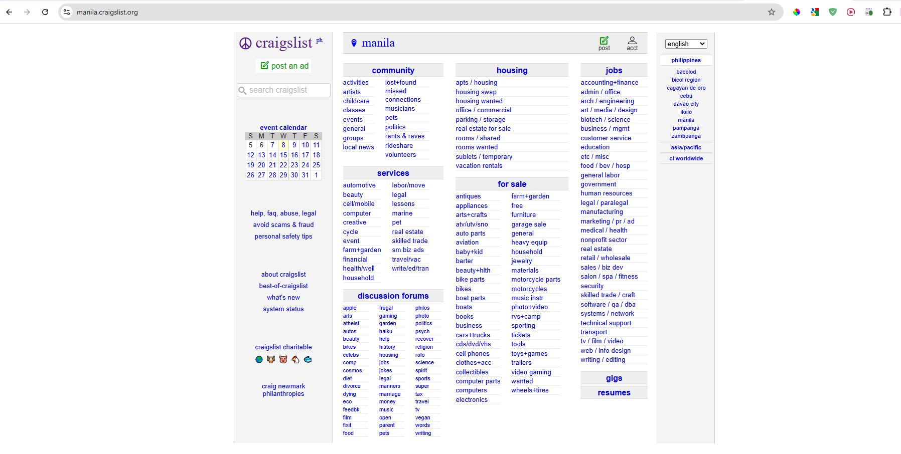

### **CSS: Bringing Style to the Web**

#### **Developmental Outcome**  
By the end of this lesson, learners will:  
1. Understand the purpose and importance of CSS in web development.  
2. Learn the basic syntax of CSS and how it works to style HTML elements.  
3. Discover how to apply CSS to a webpage in different ways (inline, internal, and external).  
4. Recognize how CSS solves design challenges and enhances the user experience.  

---

#### **Making the Web Look Good**  

Every time you visit a webpage, you don’t just see text and links—you see colors, fonts, layouts, and images all styled in a way that makes the site more visually appealing and easy to navigate. This magic happens thanks to CSS (Cascading Style Sheets). While HTML organizes the content, CSS is what makes that content look good.




In this lesson, we’ll break down CSS to understand how it works, the syntax behind it, and how you can apply it to transform a plain webpage into something visually exciting. CSS is essential for creating a positive user experience, making your website not only functional but also visually engaging.

---

#### **CSS Syntax: The Language of Style**  

CSS has a straightforward syntax that consists of selectors, properties, and values:

1. **Selector**: This is the HTML element you want to style (e.g., a paragraph or heading).  
2. **Property**: This is the style aspect you want to change (e.g., color, font-size).  
3. **Value**: This defines the setting for the property (e.g., red, 20px).

**Syntax Example**:  
```css
h1 {
  color: blue;
  font-size: 30px;
}
```
Here:
- `h1` is the **selector** (the element you want to style),
- `color` and `font-size` are the **properties**,
- `blue` and `30px` are the **values**.

---

#### **How to Apply CSS**  

There are three main ways to apply CSS to a webpage:

1. **Inline CSS**:  
   - Directly applied to an HTML element using the `style` attribute.
   - **Example**:  
   ```html
   <h1 style="color: red; font-size: 25px;">Hello World</h1>
   ```
   This changes the color and font size of that specific heading.

2. **Internal CSS**:  
   - Written inside the `<style>` tags in the `<head>` section of the HTML document.
   - **Example**:  
   ```html
   <head>
     <style>
       h1 {
         color: green;
         font-size: 30px;
       }
     </style>
   </head>
   ```

3. **External CSS**:  
   - The most efficient way, especially for larger websites. It’s placed in a separate `.css` file and linked to your HTML file.
   - **Example**:  
   ```html
   <link rel="stylesheet" type="text/css" href="styles.css">
   ```

   Inside `styles.css`:
   ```css
   h1 {
     color: purple;
     font-size: 35px;
   }
   ```

---

#### **What CSS Solves**  

CSS solves a lot of design-related problems that make the web visually appealing:

1. **Consistency**:  
   - Ensures that your webpage has a uniform look across all pages, such as consistent fonts, colors, and layouts.

2. **User Experience (UX)**:  
   - Helps to create a more enjoyable and readable experience by improving text readability, contrast, and spacing.

3. **Responsive Design**:  
   - Makes websites look great on all devices by adjusting the layout based on screen size, thanks to media queries and flexible layouts.

4. **Layout Control**:  
   - Allows precise control over how elements are positioned, whether in rows, columns, or grids.

---

#### **Key Takeaways**  

- **CSS** is the styling language used to improve the visual appeal of web pages by adding color, fonts, spacing, and positioning.
- The basic **syntax** of CSS consists of a selector, property, and value.
- You can apply CSS to a webpage through **inline**, **internal**, or **external** methods.
- CSS addresses key design challenges such as creating consistency, improving user experience, and ensuring responsiveness on different devices.
- By mastering CSS, you can turn a simple webpage into a visually engaging experience for users.