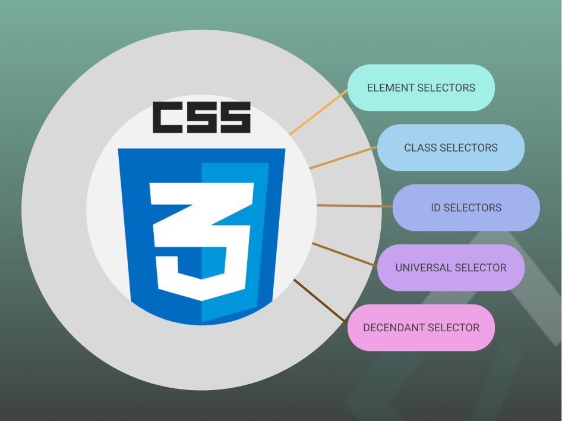

### **Selectors and Properties: Targeting Elements to Apply Styles**

#### **Developmental Outcome**  
By the end of this lesson, learners will:  
1. Understand what CSS selectors are and how they work to target HTML elements.  
2. Learn the different types of selectors, including element, class, and ID selectors.  
3. Be able to target elements effectively with CSS selectors.  
4. Get a basic understanding of how to apply styles using properties.  

---

#### **How CSS Knows What to Style**  

CSS selectors allow you to tell the browser exactly which parts of your webpage to style. Without selectors, the browser wouldn’t know where to apply the styles you write. Selectors act as indicators or arrows pointing to specific parts of a webpage (such as text or buttons) to apply changes.  

Once a selector targets an element, CSS uses **properties** to define the style changes—like adjusting the color or size of text. In this lesson, we'll focus on learning how to use selectors to pick out elements on a page and then apply styles to them.  

---

#### **CSS Selectors: Targeting HTML Elements**



CSS selectors are patterns that specify which HTML elements to style. Let’s explore the most common types:

1. **Element Selector**:  
   - Targets all elements of a specific type (tag).
   - **Example**:  
   ```css
   p {
     color: blue;
   }
   ```
   - This will change the text color of all `<p>` (paragraph) elements to blue.

2. **Class Selector**:  
   - Targets elements with a specific class attribute. Classes can be reused across multiple elements.
   - **Syntax**: A class selector begins with a dot (`.`).
   - **Example**:  
   ```css
   .highlight {
     background-color: yellow;
   }
   ```
   - This will change the background color of all elements with the class `highlight` to yellow.

3. **ID Selector**:  
   - Targets a unique element with a specific `id` attribute. IDs are unique and should only be used once on a page.
   - **Syntax**: An ID selector begins with a hash (`#`).
   - **Example**:  
   ```css
   #header {
     font-size: 30px;
   }
   ```
   - This applies a font size of 30px to the element with the `id="header"`.

4. **Universal Selector**:  
   - Selects all elements on the page.
   - **Syntax**: The universal selector is represented by an asterisk (`*`).
   - **Example**:  
   ```css
   * {
     margin: 0;
   }
   ```
   - This removes the default margin from all elements.

5. **Descendant Selector**:  
   - Selects elements that are inside other elements.
   - **Example**:  
   ```css
   div p {
     color: red;
   }
   ```
   - This will target all `<p>` elements inside a `<div>` and change their color to red.

---

#### **Applying Styles: Introduction to Properties**  

Once you’ve selected the elements, you can apply **properties** to change how those elements look. We won’t go into too much detail just yet, but properties define the appearance, such as color, size, or spacing.  

For example:
```css
p {
  color: green;
}
```
Here, `color` is the property that defines the text color, and `green` is the value that the property takes.

In the next lesson, we will dive deeper into specific properties and how to style elements effectively.

---

#### **Key Takeaways**  

- **CSS Selectors** are used to target specific elements on a webpage, like tags, classes, and IDs.
- **Common Selectors**:
  - **Element** (e.g., `p`, `h1`)
  - **Class** (e.g., `.highlight`)
  - **ID** (e.g., `#header`)
  - **Universal** (e.g., `*`)
  - **Descendant** (e.g., `div p`)
- **Properties** are used to define styles for selected elements, such as color, size, and spacing (we’ll focus on them in the next lesson).
