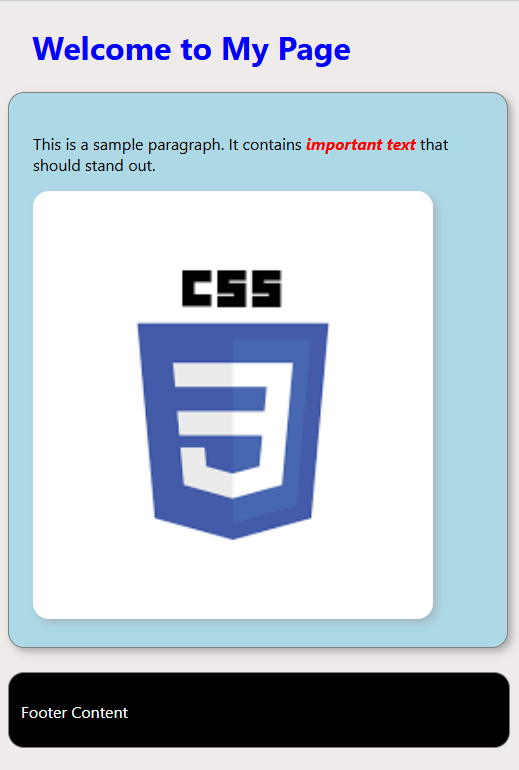

### **Assignment: Basic Styling with CSS**

In this assignment, you will practice applying basic CSS styles to an HTML file. You’ll work on styling fonts, adding margins and padding, changing background colors, adjusting element dimensions, and adding borders. Your goal is to match the appearance of your styled file to the sample output provided.

#### **Estimated Time to Completion:** 1 hour  
#### **Level of Complexity:** Beginner  

---

### **Instructions**

1. Use the provided HTML code below as your starting point. Copy it into a new file and name it `index.html`.  
2. Create a new CSS file named `styles.css` and link it to the HTML file.  
3. Save both files in a folder named `Lastname_Firstname_CSSstyling`.  
4. Follow the styling instructions below and compare your work to the provided sample output.  

---

### **Evaluation Criteria & Learning Objectives**

- Understand how to link a CSS file to an HTML document.  
- Apply basic font styles, including color, size, weight, and style.  
- Use margins and padding to create appropriate spacing.  
- Change background colors and adjust the width and height of elements.  
- Style borders and explore advanced border techniques (stretch task).  

---

#### **Directions**

**Provided HTML Code**:  
```html
<!DOCTYPE html>
<html lang="en">
<head>
    <meta charset="UTF-8">
    <meta name="viewport" content="width=device-width, initial-scale=1.0">
    <title>Basic Styling Assignment</title>
</head>
<body>
    <header>
        <h1>Welcome to My Page</h1>
    </header>
    <main class="container">
        <p>This is a sample paragraph. It contains <span>important text</span> that should stand out.</p>
        
    </main>
    <footer>
        <p>Footer Content</p>
    </footer>
</body>
</html>
```

#### **Page Requirements (MVP)**  

1. **Link the CSS File:**  
   - Ensure the `styles.css` file is correctly linked to `index.html`.  

2. **Font Styling:**  
   - Change the font color of `<h1>`.  
   - Set the font size of all `<p>` elements to 16px.  
   - Make `<span>` text both bold and italic and color red.  

3. **Spacing (Margin and Padding):**  
   - Add padding inside the `<main>` container by 24px.  
   - Set margin outside the `<h1>` by 24px.
   - Set the padding of the footer to 12px and have top margin of 24px.  

4. **Background Colors:**  
   - Change the background color of the `<body>` with rgb 240, 235, 235.
   - Change the background color of the `<main>` with 
   - Set the background color of the `<footer>` to black and adjust its text color white.  

5. **Width, Height, and Borders:**  
   - Resize the image while maintaining its aspect ratio around 400px.  
   - Add a border around the `<main>` container and have it's width 450px.  
   - Adjust footer width to 476px with a height of 50px. Also add a border with a gray color.



---

#### **Stretch Requirements**

1. **Advanced Border Styling:**  
   - Add rounded edges to the `<main>` container, footer and image by 16px.  
   - Apply a shadow effect to the main and image.  

2. **Custom Fonts:**  
   - Use a Google Font (e.g., "Roboto" or "Open Sans") for all text.  

3. **Interactive Elements:**  
   - Add a hover effect that changes the background color of `<footer>`. 

---

### **Submission Guidelines**

1. Save your files as `index.html` and `styles.css`.  
2. Place both files in a folder named `Lastname_Firstname_CSSstyling`.  
3. Submit the entire folder via the designated platform or email it to your instructor with the subject line: "CSS Styling Assignment."  

---

### **Important Notes**

- Test your work in a browser to ensure it matches the sample output.  
- Use consistent indentation and comments to make your CSS code readable.  
- Focus on following the instructions to achieve the desired result.  

