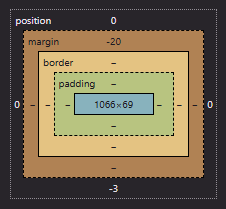

### **Lesson: Understanding the Box Model**

#### **Developmental Outcomes**
By the end of this lesson, learners will:
1. Understand the concept of the CSS Box Model.
2. Visualize how elements occupy space on a webpage.
3. Identify the components of the Box Model and their roles in layout design.

---

#### **The Box Model as a Framework**

Every element on a webpage can be thought of as a box, whether it’s text, an image, or a button. These boxes need to be arranged properly to make the page look organized and functional. Understanding the Box Model is like knowing how much room your furniture takes up in a room—it helps you plan and arrange everything neatly.

The CSS Box Model is the way browsers calculate and display the size of elements on a webpage. Each element is treated as a rectangular box, with different layers determining its appearance and how it interacts with other elements. These layers are:

1. **Content**: The innermost part of the box where the actual content (text, image, etc.) is displayed.
2. **Padding**: Space between the content and the border, like a cushion that gives breathing room.
3. **Border**: The edge surrounding the padding and content, which can be styled for emphasis.
4. **Margin**: The outermost layer, creating space between the box and other elements.

***You can check the box model through using `inspect element`, in the styles tab.*

---

#### **Visualizing the Box Model**

Picture yourself setting up a dining table for a meal. At the center of the table is the plate holding the food—this is your **content**. Surrounding the plate is a placemat, which keeps the plate from touching the bare table—this represents the **padding**. Around the placemat, you might place a decorative frame or an edge to highlight it—this acts as the **border**. Finally, you leave space between each setting so diners aren’t bumping elbows—this is your **margin**.

Each part plays an essential role in creating an orderly and functional setup. Similarly, on a webpage, the Box Model ensures elements are spaced out correctly and appear visually balanced.

---

#### **Why is the Box Model Important?**

Understanding the Box Model is essential for:

1. **Precise Layouts**: It helps you control how much space an element takes up and its position on the page.
2. **Avoiding Overlaps**: Proper margins and padding ensure elements don’t overlap unintentionally.
3. **Responsive Design**: Knowing how the Box Model works makes it easier to create layouts that adjust well to different screen sizes.
4. **Debugging Issues**: Many layout problems stem from misunderstanding the Box Model. Recognizing its layers makes fixing these issues simpler.

---

#### **Components of the Box Model in Detail**

1. **Content**: The core area where the content resides. Its size can be adjusted using properties like `width` and `height`.
   - Example: Setting `width: 300px` and `height: 200px` defines the size of the content box.

2. **Padding**: Adds space inside the element but outside the content.
   - Example: `padding: 10px;` adds 10 pixels of space inside the border, around the content.

3. **Border**: Surrounds the padding and content, customizable with properties like `border-width`, `border-style`, and `border-color`.
   - Example: `border: 2px solid black;` creates a 2-pixel black border.

4. **Margin**: Adds space outside the element, separating it from others.
   - Example: `margin: 15px;` ensures 15 pixels of space between the element and its neighbors.

---

#### **Real-World Example**

- *Without understanding the Box Model*: Elements on your webpage might overlap, look cramped, or have inconsistent spacing. It’s like trying to fit too much furniture into a room without measuring—it leads to a cluttered and chaotic space.

- *With the Box Model*: You can arrange elements neatly, ensuring proper spacing, alignment, and aesthetics, just like a well-organized room where everything fits perfectly and looks inviting.

---

#### **Key Takeaways**

- The **CSS Box Model** is the foundation for understanding how elements occupy space on a webpage.
- Visualizing it as a dining table setup or room arrangement helps beginners grasp the concept more easily.
- Mastery of the Box Model is crucial for creating organized, responsive, and visually appealing web layouts.

