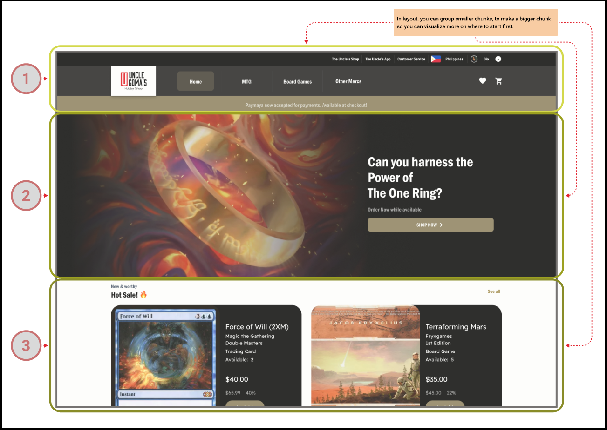

### **Structuring for Success: Mastering Layouts and Techniques**

#### **Developmental Outcomes**
By the end of this lesson, learners will:
1. Understand the importance of proper layout in web design.
2. Learn the differences between fixed, fluid, and responsive layouts.
3. Identify key layout techniques and when to use them.
4. Use tools like Balsamiq or Figma for planning layouts.
5. Apply previous concepts like the Box Model, Positioning, and Display Properties to create organized and effective layouts.

---

#### **The Foundation of Web Organization**

Creating a webpage without a layout plan is like trying to arrange furniture in a new home without considering space or functionality. Everything ends up scattered, and nothing feels cohesive. A solid layout ensures every element has its place, making the design functional and visually appealing. This lesson dives into how layouts work, how to approach structuring webpages effectively, and the use of design tools for planning.

---

#### **Why Layouts Matter**

Good layouts are the backbone of an excellent user experience. They:
- **Guide Users**: Direct attention to important sections, like navigation menus or calls to action.
- **Enhance Readability**: Group related content, making information easier to digest.
- **Ensure Responsiveness**: Adapt seamlessly across different devices and screen sizes.
- **Streamline Workflow**: Help you plan and execute designs efficiently, especially when using tools like Balsamiq or Figma.

---

#### **Fixed, Fluid, and Responsive Layouts**

1. **Fixed Layout**:
   - Elements have specific widths, which don’t change regardless of the screen size.
   - **Use Case**: Ideal for designs where consistency is essential (e.g., internal reports).
   - **Limitation**: Doesn’t adapt well to smaller screens.

2. **Fluid Layout**:
   - Uses relative units like percentages to allow elements to expand and shrink with the screen size.
   - **Use Case**: Great for basic responsiveness on varied screen sizes.
   - **Limitation**: Can appear stretched or cramped if not properly managed.

3. **Responsive Layout**:
   - Combines fixed and fluid techniques, often using CSS media queries to adapt layouts for different devices.
   - **Use Case**: Standard for modern websites, ensuring compatibility across desktops, tablets, and mobile devices.

---

#### **Organizing Layouts: Grouping for Simplicity**



To approach layouts systematically, divide your webpage into logical sections:

1. **Header**:
   - Includes the logo, site title, and navigation bar.
   - **Tip**: Design this section first, as it sets the tone for the rest of the page.

2. **Main Content**:
   - Divide into sections like articles, images, or videos.
   - Use the Box Model to ensure elements have enough padding, margins, and borders for clarity.

3. **Sidebar (Optional)**:
   - Houses secondary navigation or additional links.
   - **Tip**: Keep it consistent but unobtrusive.

4. **Footer**:
   - Contains copyright information, contact details, and quick links.
   - **Tip**: Use simple layouts to ensure usability even on smaller screens.

By planning each section individually, you’ll create a more organized structure. Tools like Balsamiq or Figma can help sketch these sections and visualize the layout before implementation.

---

#### **Using Tools for Layout Design**

1. **Balsamiq**:
   - A simple wireframing tool perfect for sketching layouts quickly.
   - **Use Case**: Create a draft structure for your webpage, focusing on grouping elements logically.

2. **Figma**:
   - A more advanced design tool for interactive layouts and collaboration.
   - **Use Case**: Design detailed prototypes with visual elements and share them with teams for feedback.

---

#### **Layout Techniques**

1. **Using CSS Grid**:
   - Best for creating two-dimensional layouts (rows and columns).
   - **Example**:
     ```css
     .container {
       display: grid;
       grid-template-columns: 1fr 2fr;
       gap: 20px;
     }
     ```
     **Use Case**: Laying out a main content area with a sidebar.

2. **Using Flexbox**:
   - Ideal for one-dimensional layouts (either rows or columns).
   - **Example**:
     ```css
     .container {
       display: flex;
       justify-content: space-between;
     }
     ```
     **Use Case**: Aligning navigation items horizontally.

3. **Floats and Clearfix (Legacy)**:
   - Originally used for layout before modern techniques like Grid and Flexbox.
   - **Tip**: Avoid unless maintaining older websites.

4. **Positioning for Overlaps**:
   - Use `position: absolute` or `fixed` to overlay or pin elements.
   - **Tip**: Combine with z-index for layered effects.

---

#### **Applying Previous Concepts**

- **Box Model**: Ensure proper spacing around content with padding, margins, and borders.
- **Display Properties**: Define how elements interact (e.g., inline for buttons, block for sections).
- **Positioning**: Strategically place elements for better navigation and functionality.

---

#### **Key Takeaways**

- Proper layouts make websites more functional, appealing, and user-friendly.
- Start by grouping elements logically: header, main content, sidebar, and footer.
- Use tools like Balsamiq or Figma to draft and refine layout plans.
- Choose the right technique (Grid, Flexbox, etc.) based on your layout’s needs.
- Apply foundational CSS concepts to achieve polished and responsive designs.