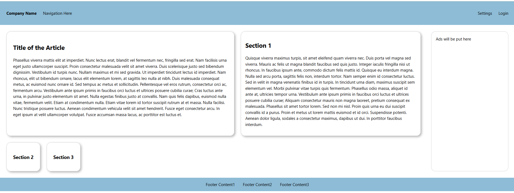

### **Assignment: Box Puzzle Layout**

Your task is to duplicate a given layout design as closely as possible using only HTML and CSS. This assignment focuses on practicing the **CSS Box Model**, **Flexbox**, and layout positioning.

#### **Estimated Time to Completion:** 2-3 hours  
#### **Level of Complexity:** Intermediate  

---

### **Instructions**

1. Analyze the provided visual design or description of the layout.  
2. Use **HTML and CSS** to replicate the design as accurately as possible.  
3. Do not use any external libraries or frameworks (e.g., Bootstrap).  
4. Focus on:
   - Proper HTML structure.
   - Applying the CSS box model effectively.
   - Using Flexbox for positioning and layout.

---

### **Evaluation Criteria & Learning Objectives**

- Correct usage of the CSS Box Model (padding, margins, borders).  
- Proper application of Flexbox properties (`justify-content`, `align-items`, `flex-wrap`, etc.).  
- Logical and semantic HTML structure for the layout.  
- Ability to create a visually accurate and functional duplicate of the sample layout.  

---

### **Directions**

#### **Page Requirements (MVP)**

- **Header Section:**  
  A navigation bar containing two groups of items:
  - Left side: "Company Name" and "Navigation Here."
  - Right side: "Settings" and "Login."

- **Main Content:**  
  - An **article** section with:
    - A title (e.g., "Title of the Article").  
    - A paragraph of text.
  - **Three additional sections** within the main content area.  
  - An **aside** area for ads.

- **Footer Section:**  
  A footer containing three pieces of content arranged horizontally.

#### **Good Practices:**
- Ensure your code is well-indented and readable.  
- Avoid using inline styles.  
- Make sure the layout is responsive to different screen sizes.

---

#### **Stretch Requirements**

- Ensure the layout is fully responsive, using Flexbox properties like `flex-wrap` and `media queries` if needed.  
- Add hover effects for buttons or links for interactivity.  

---

### **Submission Guidelines**

1. Create a folder named `lastname_firstname_boxpuzzle`.  
2. Save all related files in this folder:  
   - `index.html` for your HTML file.  
   - `styles.css` for your CSS file.  
3. Compress the folder into a `.zip` file.  
4. Submit the `.zip` file via the designated platform or email it to your instructor with the subject line: "Box Puzzle Assignment Submission."  

---

### **Important Notes**
- Use only HTML and CSS for this assignment.  
- Focus on the layout, not styling or animations.  
- Use semantic tags where appropriate.  
