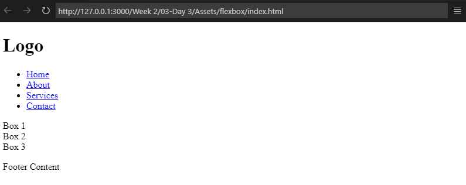
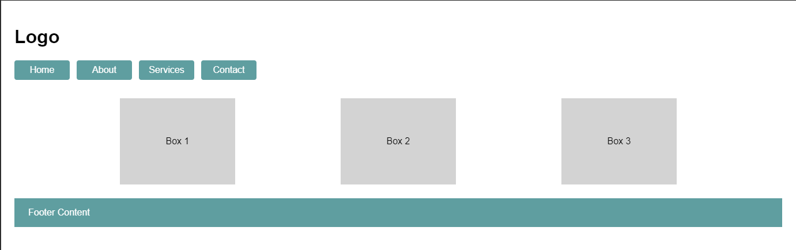

### **Practice Assignment: Flexbox Mastery - Navigation Bar and Layouts**  

In this assignment, you’ll apply your understanding of Flexbox to create a visually appealing and functional navigation bar. You’ll also explore other sections of the webpage to practice Flexbox properties, ensuring proper alignment, spacing, and layout structure. This task reinforces your ability to work with `flex-direction`, `justify-content`, and `align-items`, along with optional advanced properties like `flex-wrap`.  

#### **Estimated Time to Completion:** 45 minutes to 1.5 hours
#### **Level of Complexity:** Beginner to Intermediate  

---  

### **Instructions**  

1. Use the raw HTML structure provided below as your starting point.  
2. Using a separate CSS file (`styles.css`), style the navigation bar and additional sections to replicate the provided layout image.  
3. Focus on the main Flexbox properties to achieve the desired alignment, spacing, and layout structure.  
4. Optionally, experiment with advanced properties like `flex-wrap` or `align-content` to explore further use cases.  

---

#### **Raw HTML Structure**  

```html  
<!DOCTYPE html>  
<html lang="en">  
<head>  
    <meta charset="UTF-8">  
    <meta name="viewport" content="width=device-width, initial-scale=1.0">  
    <title>Flexbox Practice</title>  
</head>  
<body>  
    <header class="navbar">  
        <h1 class="logo">Logo</h1>  
        <ul class="nav-links">
            <li><a href="#">Home</a></li>
            <li><a href="#">About</a></li>
            <li><a href="#">Services</a></li>
            <li><a href="#">Contact</a></li>     
        </ul>  
    </header>  

    <main class="content">  
        <div class="box">Box 1</div>  
        <div class="box">Box 2</div>  
        <div class="box">Box 3</div>  
    </main>  

    <footer class="footer">  
        <p>Footer Content</p>  
    </footer>  
</body>  
</html>  
```  

Raw HTML display:



---

### **Evaluation Criteria & Learning Objectives**  

- Demonstrate an understanding of Flexbox properties and their applications.  
- Accurately replicate the layout image using CSS Flexbox.  
- Practice structuring and aligning webpage sections effectively.  
- Apply best practices for clean, readable, and maintainable code.  

---

### **Directions**  

#### **Page Requirements (MVP)**  



1. **Body:**
   - Use flex as display property, and make sure that the main containers are spaced 24px from each other. Add a 24px margin, and set Arial as the default font.

2. **Navigation Bar:**  
   - Use Flexbox to align navigation links (`Home`, `About`, `Services`, `Contact`) horizontally, and starts from the left.  
   - Make sure that the links have spaces.
   - The links should have 8px of padding and 80px width, and color it with cadetblue.

3. **Main Content Sections:**  
   - Style three content boxes (`Box 1`, `Box 2`, `Box 3`) using Flexbox.
   - Set the dimensions of the boxes with width to 200px and a height of 150px, and have it colored with Lightgray.  
   - Have the boxes spaced evenly from each other, and make sure the text on each box will be centered.

4. **Footer Section:**
   - Have the container height 50px and the background-color cadetblue.

5. **File Setup:**  
   - Save your CSS file as `styles.css` and link it to the HTML.  
   - Include comments in your CSS to explain key Flexbox rules applied.  

#### **Stretch Requirements**  

1. Figure out on how to remove the bullet and underline in the navigation links.

2. Figure out a way to space the flex items without using margins or padding.

---

### **Submission Guidelines**  

1. Save your completed CSS file as `lastname_firstname_flexbox.css`.  
2. Submit the file via the designated platform or email it to your instructor with the subject line: "CSS Assignment: Flexbox Mastery."  
3. Include screenshots of your completed webpage in your submission.  

---  

### **Important Notes**  

- Focus on using Flexbox properties to achieve alignment and spacing.  
- Avoid adding unnecessary elements or unrelated styling to the provided HTML structure.  
- Include comments to explain the Flexbox rules and choices you’ve made in your CSS file.  