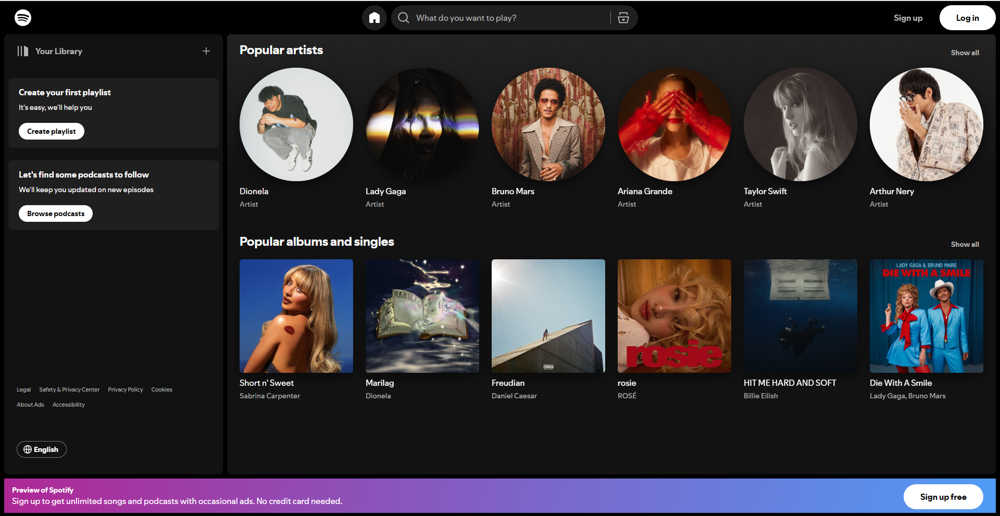

Here’s a structured project assignment for your trainees to clone a screenshot of a chosen website using only **HTML** and **CSS**. 

---

### **Project: Website Screenshot Clone**

#### **Objective**  
The goal is to replicate the layout and design of a provided website screenshot as closely as possible using only **HTML** and **CSS**. This project will help you practice web development fundamentals like:  
- Structuring content using semantic HTML.  
- Applying CSS for layout and styling.  
- Using tools like Flexbox and the Box Model to achieve responsiveness and alignment.  
- Searching for and incorporating images and icons effectively.

---

### **Estimated Time to Completion**  
4 hours  

### **Level of Complexity**  
Beginner to Intermediate  

---

### **Instructions**

1. **Analyze the Screenshot**  
   - Study the layout and break it into sections (e.g., header, navigation, hero section, content, and footer).  
   - Identify the key components (e.g., fonts, colors, spacing).  

2. **Set Up the Project**  
   - Create a folder named `lastname_firstname_screenshotclone`.  
   - Inside the folder, create an `index.html` file and a `styles.css` file.  
   - Link the CSS file to your HTML.  

3. **Structure the Content**  
   - Use semantic HTML elements like `<header>`, `<nav>`, `<main>`, `<section>`, `<footer>`, etc.  
   - Add placeholder text or dummy content if necessary (e.g., `Lorem Ipsum` for text).  

4. **Style the Page**  
   - Use CSS to replicate the layout, colors, and spacing.  
   - Apply the **Box Model** for padding, margins, and borders.  
   - Use **Flexbox** or CSS Grid for alignment and positioning.  

5. **Search for Assets**  
   - Look for similar images and icons used in the design.  
   - Use free resources like [Unsplash](https://unsplash.com/), [Pexels](https://www.pexels.com/), or [Font Awesome](https://fontawesome.com/).  

6. **Test and Adjust**  
   - Check your design on different screen sizes (if applicable).  
   - Make adjustments to get the layout as close as possible to the screenshot.  

---

### **Requirements (MVP)**

**Screenshot to be cloned**

1. **Basic Layout**  
   - Use proper HTML structure for the header, navigation, content, and footer.  
   - Ensure the layout visually matches the screenshot.  

2. **Styling**  
   - Apply accurate fonts, colors, and spacing.  
   - Implement proper use of margins, padding, and borders using the **Box Model**.  
   - Use **Flexbox** for alignment and layout.  

3. **Images and Icons**  
   - Search for and include images/icons that closely resemble the ones in the screenshot.  

4. **Good Practices**  
   - Write clean, indented code.  
   - Use meaningful class names for CSS.  
   - Apply semantic HTML elements where possible.  

---

### **Stretch Goals**  

1. **Typography**  
   - Use Google Fonts to match the typography from the screenshot.  

2. **Hover Effects**  
   - Add simple hover effects for buttons or links.  

3. **Responsiveness**  
   - Ensure the design adapts well to smaller screens using media queries.  

4. **Refinement**  
   - Add small details like shadows, gradients, or precise spacing to get closer to the original design.  

---

### **Evaluation Criteria & Learning Objectives**  

- **HTML Structure**: Proper use of semantic tags and clean organization.  
- **CSS Styling**: Accurate layout, spacing, and colors.  
- **Good Practices**: Clean and readable code with proper naming conventions.  
- **Problem-Solving**: Ability to search for and adapt assets (images/icons).  

---

### **Submission Guidelines**

1. Submit the folder `lastname_firstname_screenshotclone` containing the following files:  
   - `index.html`  
   - `styles.css`  

2. Compress the folder into a ZIP file named `lastname_firstname_screenshotclone.zip`.  

3. Submit your ZIP file via the designated platform or email it to your instructor.  

---

### **Important Notes**  
- This project is not about perfection—it’s about learning. Focus on applying the fundamentals and improving your skills.  
- If you get stuck, take a break or ask for guidance from peers or instructors.  