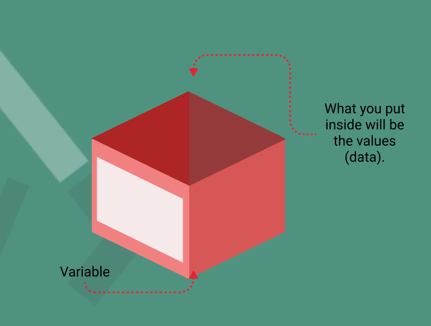

### **Variables in JavaScript - Storing Information, Simplifying Logic**

#### **Developmental Outcomes:**
By the end of this lesson, trainees will be able to:
1. Understand the purpose of variables in programming.
2. Recognize the difference between `var`, `let`, and `const` and their best use cases.
3. Declare, initialize, and use variables effectively in JavaScript code.

---

#### **Variables**
Variables are like labeled boxes where you can store information to use later. They allow you to give a name to a piece of data so your program can remember and manipulate it. Without variables, programming would feel like trying to do math without paper—chaotic and unsustainable!



#### **Why Use Variables?**
- **Store Data:** Keep user inputs, calculations, or fetched data for reuse.
- **Simplify Logic:** Assign meaningful names to make your code more readable.
- **Enable Changes:** Easily update values instead of hardcoding them repeatedly.

**Example:** A variable called `userName` stores the name of a visitor to greet them later.
```javascript
let userName = "Alice";
console.log("Welcome, " + userName + "!"); // Outputs: Welcome, Alice!
```

---

#### **Declaring Variables in JavaScript**
JavaScript offers three ways to declare variables: `var`, `let`, and `const`. Let’s explore when and why to use each.

**1. `let` (Your Go-To Choice)**
- Used for variables whose values might change later.
- Block-scoped, meaning it exists only within the `{}` where it’s declared.

**Example:**
```javascript
let age = 25;
age = 26; // You can update a `let` variable.
console.log(age); // Outputs: 26
```

**2. `const` (For Values That Don’t Change)**
- Short for "constant," use it when you’re sure the value won’t change.
- Also block-scoped, but can’t be reassigned after declaration.

**Example:**
```javascript
const pi = 3.14;
// pi = 3.15; // This would throw an error.
console.log(pi); // Outputs: 3.14
```

**3. `var` (Old and Rarely Used)**
- Function-scoped, meaning it doesn’t respect block boundaries (can lead to bugs).
- Considered outdated; `let` and `const` are better alternatives.

**Example:**
```javascript
var city = "New York";
city = "London"; // You can update it, but beware of scope issues.
console.log(city); // Outputs: London
```

---

#### **Choosing Between `let` and `const`**
As a rule of thumb:
- Use `const` by default to prevent accidental changes.
- Switch to `let` if you expect the value to change during the program.

**Why This Practice?**
- Prevents bugs caused by unintended changes.
- Makes code easier to read by clarifying intent (e.g., "This value won’t change").

---

#### **How Variables Solve Problems**

**Problem 1: Reuse Data**

If a user’s name is needed multiple times, variables save you from typing it repeatedly.
```javascript
let userName = "Bob";
console.log("Hi, " + userName);
console.log(userName + " is logged in.");
```

**Problem 2: Simplify Updates**

Changing the value of a variable updates all references instantly.
```javascript
let price = 100;
price = 90; // New discounted price.
console.log("The price is: $" + price); // Outputs: $90
```

**Problem 3: Dynamic Values**

Store user inputs or calculated results.
```javascript
let number1 = 5;
let number2 = 10;
let sum = number1 + number2;
console.log(sum); // Outputs: 15
```

---

#### **Common Pitfalls and Best Practices**
- **Always Declare Variables:** Avoid using undeclared variables, which can cause errors.
  ```javascript
  myVar = 10; // Bad practice. Always declare using `let` or `const`.
  let myVar = 10; // Good practice.
  ```

- **Use Descriptive Names:** Choose meaningful variable names.
  ```javascript
  let x = 10; // Not clear.
  let userAge = 10; // Descriptive and clear.
  ```

- **Stick to `const` Where Possible:** Prevent bugs by using constants unless values need to change.

---

#### **Key Takeaways:**
- Variables store information and simplify logic in your program.
- Use `let` for values that change, and `const` for values that stay constant.
- Avoid `var` due to its scope issues.
- Well-named variables make your code easier to read and maintain.

