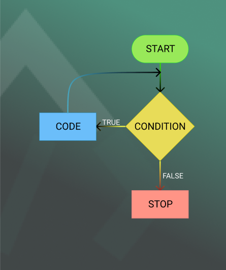

### **Lesson: Repeating Tasks with Loops in JavaScript**

#### **Learning Objectives:**

By the end of this lesson, trainees will be able to:

1. Define the purpose of loops in programming.
2. Use for, while, and forEach loops to repeat tasks.
3. Apply control keywords (break, continue, return) to manage loop behavior.
4. Identify appropriate use cases for different types of loops.

---

### **Loops: The Power of Repetition**
Imagine you want to tell a story to 10 people. Instead of repeating it 10 times, wouldn’t it be easier to tell it once and have a microphone repeat it for everyone? In programming, loops act like that microphone, repeating tasks efficiently without writing repetitive code.



---

### **1. The `for` Loop: A Counted Repeater**
The `for` loop is great when you know exactly how many times you need to repeat something. It has three parts:
1. **Initialization**: Set a starting value.  
2. **Condition**: Define when to stop.  
3. **Increment/Decrement**: Update the value after each iteration.

**Example: Counting Numbers**
```javascript
for (let i = 1; i <= 5; i++) {
  console.log(`Counting: ${i}`);
}
```

**Output:**  
```
Counting: 1  
Counting: 2  
Counting: 3  
Counting: 4  
Counting: 5  
```

**Use Case:**  
- Looping through a fixed range of numbers, such as printing a sequence or generating a table.

---

### **2. The `while` Loop: Flexible Repeater**
The `while` loop keeps running as long as its condition is true. It’s useful when you don’t know exactly how many repetitions are needed.

**Example: Waiting for a Condition**
```javascript
let counter = 0;

while (counter < 3) {
  console.log(`Counter is at: ${counter}`);
  counter++;
}
```

**Output:**  
```
Counter is at: 0  
Counter is at: 1  
Counter is at: 2  
```

**Use Case:**  
- Repeating until an external condition changes, such as waiting for user input.

---

### **3. The `forEach` Loop: Iterating Through Arrays**
The `forEach` loop is designed for arrays. It automatically goes through each item in the array and applies the same logic.

**Example: Greeting Friends**
```javascript
let friends = ["Alice", "Bob", "Charlie"];

friends.forEach((friend) => {
  console.log(`Hello, ${friend}!`);
});
```

**Output:**  
```
Hello, Alice!  
Hello, Bob!  
Hello, Charlie!  
```

**Use Case:**  
- Performing actions on each item in a list, such as displaying user data or processing items.

---

### **4. Control Keywords: Fine-Tuning Loops**

#### **a) `break`: Stop the Loop**
The `break` keyword immediately exits the loop, regardless of the condition.

**Example: Stop at a Specific Value**
```javascript
for (let i = 1; i <= 10; i++) {
  if (i === 5) {
    console.log("Stopping early!");
    break;
  }
  console.log(i);
}
```

**Output:**  
```
1  
2  
3  
4  
Stopping early!  
```

**Use Case:**  
- Stop searching when you find what you need in a list.

---

#### **b) `continue`: Skip the Current Iteration**
The `continue` keyword skips the rest of the current iteration and moves to the next one.

**Example: Skip Even Numbers**
```javascript
for (let i = 1; i <= 5; i++) {
  if (i % 2 === 0) {
    continue;
  }
  console.log(i);
}
```

**Output:**  
```
1  
3  
5  
```

**Use Case:**  
- Skipping over invalid or unwanted data in a loop.

---

#### **c) `return`: Exit a Function in a Loop**
The `return` keyword exits the entire function, stopping both the loop and the function.

**Example: Find and Return a Value**
```javascript
function findNumber(numbers, target) {
  for (let number of numbers) {
    if (number === target) {
      return `Found ${target}!`;
    }
  }
  return `${target} not found.`;
}

console.log(findNumber([1, 2, 3, 4], 3)); // Output: Found 3!
```

**Use Case:**  
- Stop a loop when a result is achieved and exit the function early.

---

### **Choosing the Right Loop for the Job**
- **`for` Loop:** Best for repeating tasks a set number of times.  
- **`while` Loop:** Ideal for repeating until a condition is met.  
- **`forEach` Loop:** Perfect for iterating through arrays when working with each element individually.

---

### **Key Takeaways**
1. Loops simplify repetitive tasks in your code.  
2. Choose the loop type based on your task: `for`, `while`, or `forEach`.  
3. Use control keywords like `break`, `continue`, and `return` to refine loop behavior.  
4. Writing efficient loops makes your code cleaner and easier to maintain.  