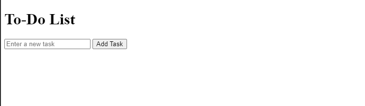
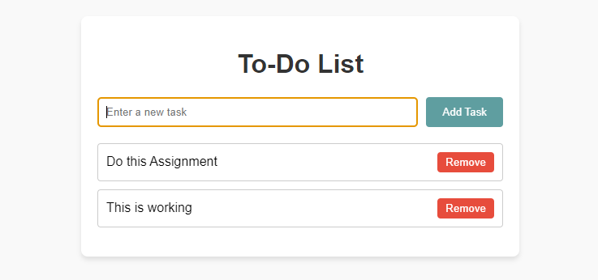

### **Assignment: Interactive To-Do List with DOM Manipulation**  

In this assignment, you’ll use your knowledge of DOM manipulation, event listeners, and functions to create an interactive **To-Do List**. This will involve dynamically adding, removing, and marking tasks as complete, giving you hands-on experience with JavaScript.

#### **Estimated Time to Completion:** 1–4 hours  
#### **Level of Complexity:** Beginner to Intermediate  

---

### **Instructions**  

1. Use the raw HTML structure provided below as your starting point.  
2. Write JavaScript code in a separate file (`script.js`) to make the to-do list functional.  
3. Incorporate DOM manipulation, event listeners, and functions to handle user interactions.  

---

#### **Raw HTML Structure**  

```html  
<!DOCTYPE html>  
<html lang="en">  
<head>  
    <meta charset="UTF-8">  
    <meta name="viewport" content="width=device-width, initial-scale=1.0">  
    <title>Interactive To-Do List</title>  
    <link rel="stylesheet" href="styles.css">
</head>  
<body>  
    <div class="container">  
        <h1>To-Do List</h1>  
        <form id="taskForm">  
            <input type="text" id="taskInput" placeholder="Enter a new task" required>  
            <button type="submit">Add Task</button>  
        </form>  
        <ul id="taskList"></ul>  
    </div>  

    <script src="script.js"></script>  
</body>  
</html>  
```  

Raw HTML display:  


---

### **Evaluation Criteria & Learning Objectives**  

- Understand and apply DOM manipulation to dynamically update webpage content.  
- Use event listeners to handle user interactions.  
- Structure and call functions to perform specific tasks.  
- Write clean and modular JavaScript code.  

---

### **Directions**  

#### **Page Requirements (MVP)**  



1. **Add New Task:**  
   - When the user enters text in the input field and clicks "Add Task," the task should appear as a new item in the list.  
   - Clear the input field after the task is added.  

2. **Mark Task as Complete:**  
   - Clicking on a task in the list should toggle its completion state.  
   - Add a visual indicator for completed tasks (e.g., line-through text or a green checkmark).  

3. **Remove Task:**  
   - Each task should have a "Remove" button that, when clicked, deletes the task from the list.  

4. **Error Handling:**  
   - Prevent adding empty tasks (show an alert or highlight the input field).  

5. **File Setup:**  
   - Save your JavaScript code in `script.js` and link it to the HTML.  
   - Include comments in your JavaScript to explain key DOM and event listener logic.  

#### **Stretch Requirements**  

1. **Save Tasks to Local Storage:**  
   - Make the tasks persist after the page reloads by storing them in `localStorage`.  
   - Load the saved tasks when the page is loaded.  

2. **Edit Tasks:**  
   - Add a feature to edit a task when double-clicked.  

3. **Style the To-Do List:**  
   - Use CSS to style the to-do list, making it visually appealing (e.g., highlight completed tasks, improve layout).  

---

### **Submission Guidelines**  

1. Save your completed JavaScript file as `lastname_firstname_todo.js`.  
2. Submit the file via the designated platform or email it to your instructor with the subject line: "DOM Assignment: To-Do List."  
3. Include screenshots of your completed to-do list in your submission.  

---

### **Important Notes**  

- Focus on DOM methods such as `createElement`, `appendChild`, and `removeChild`.  
- Use event listeners like `addEventListener` to handle user actions.  
- Include meaningful comments in your code to explain your logic and approach.  
