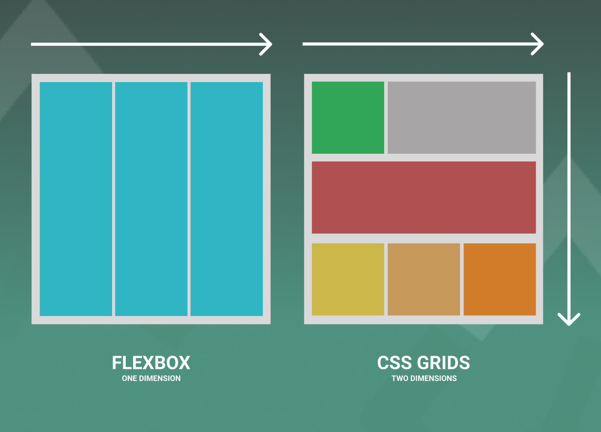

### **Mastering Flexbox and Grid in Web Development**

#### **Learning Objectives:**  
By the end of this lesson, trainees will be able to:  

1. **Compare** the key differences between **Flexbox** and **CSS Grid**.  
2. **Implement** **CSS Grid** to create advanced layout designs.  
3. **Determine** when to use **Flexbox** or **Grid** based on specific layout requirements.  
4. **Combine** **Flexbox** and **Grid** to build flexible and responsive web designs.  

---

#### **What is Flexbox?**  
**Flexbox** is a layout model designed to make it easier to align and distribute space among items in a container, even when their size is unknown or dynamic. Flexbox works on a one-dimensional axis (either row or column) and is useful for aligning items in a specific direction.

Flexbox is great for creating responsive layouts, especially when elements need to be aligned or distributed across the page. Examples include navigation bars, centering content, and responsive grids that adjust to different screen sizes.

---

#### **What is CSS Grid?**  
**CSS Grid** is a two-dimensional layout system for the web. Unlike Flexbox, which works on one axis, Grid enables layout designs with both rows and columns. It’s ideal for creating more complex layouts, like photo galleries, dashboards, and overall page structures.
 
CSS Grid is perfect for complex, structured layouts. It allows you to create grids with explicit rows and columns and place items anywhere within the grid. It’s especially useful for large-scale layouts, such as page layouts with multiple components.

---

### **Flexbox vs. Grid: When to Use Which?** 



| Feature             | Flexbox                       | Grid                          |
|---------------------|------------------------------|------------------------------|
| Layout Type         | One-dimensional (row/column)  | Two-dimensional (rows + columns) |
| Ideal Use Case      | Aligning items in a single direction (e.g., navigation bars) | Creating structured layouts (e.g., photo galleries, dashboards) |
| Flexibility         | Great for content alignment  | Great for entire page layouts |

---

### **Key Concepts in Flexbox and Grid**

#### **Flexbox Syntax**  
Flexbox focuses on aligning items within a container along one axis (horizontal or vertical).  
```css
.container {
  display: flex;
  justify-content: space-between;
  align-items: center;
}
```

#### **CSS Grid Syntax**  
Grid defines both rows and columns, allowing for more complex, two-dimensional layouts.  
```css
.container {
  display: grid;
  grid-template-columns: repeat(3, 1fr);
  gap: 10px;
}
```

---

### **Understanding the `fr` Unit in CSS Grid**

The `fr` unit in CSS Grid stands for **fractional unit**, and it is a flexible unit of measurement. It divides the available space into proportional shares. This makes it incredibly useful for creating dynamic layouts that adjust based on the size of the container.

#### **How `fr` is Different from Other Units:**
- **Pixels (`px`)**: Fixed size and doesn’t adjust based on the container.
- **Percentages (`%`)**: Relative to the size of the parent element but doesn’t account for leftover space.
- **`fr`**: Distributes available space proportionally among grid tracks, ensuring a flexible and responsive layout.

#### **Example:**
```css
.container {
  display: grid;
  grid-template-columns: 1fr 2fr 1fr; /* 1 part, 2 parts, 1 part */
}
```
In this example, the second column will take up twice as much space as the first and third columns.

#### **When to Use `fr`**
Use `fr` when you want to allocate space dynamically, such as in responsive designs or when dividing a layout proportionally.

---

### **Using CSS Grid for Layouts**

#### **Defining Grid Structure**  
CSS Grid uses `grid-template-columns` and `grid-template-rows` to define the structure of your layout.  
```css
.container {
  display: grid;
  grid-template-columns: 1fr 2fr 1fr;
  grid-template-rows: auto 100px;
}
```

#### **Adding Gaps Between Items**  
Use `gap` to add spacing between grid items.  
```css
.container {
  display: grid;
  gap: 20px;
}
```

---

### **Real-World Applications of Flexbox and Grid**

#### **1. Photo Gallery with CSS Grid**  
Grid is ideal for creating a responsive photo gallery where the number of columns adjusts to the screen width.  
```css
.gallery {
  display: grid;
  grid-template-columns: repeat(auto-fill, minmax(150px, 1fr));
  gap: 15px;
}
```

#### **2. Dashboard Layout with Grid**  
Grid is perfect for organizing components like charts, stats, and widgets in a dashboard layout.  
```css
.dashboard {
  display: grid;
  grid-template-areas: 
    "header header"
    "sidebar main"
    "footer footer";
  gap: 20px;
}
```

#### **3. Using Flexbox for Navigation Bars**  
Flexbox works well for creating navigation bars where the items need to be aligned in a single row or column.  
```css
.navbar {
  display: flex;
  justify-content: space-around;
}
```

---

### **Combining Flexbox and Grid**  
For complex layouts, you can use both Flexbox and Grid together. For instance, use **Grid** for the overall page structure and **Flexbox** for aligning items within a section.

#### **Example: Dashboard Layout**  
```css
.dashboard {
  display: grid;
  grid-template-areas: 
    "header header"
    "sidebar main"
    "footer footer";
}

.widget {
  display: flex;
  justify-content: space-between;
  align-items: center;
}
```

---

### **Key Takeaways:**  
1. **Flexbox** is ideal for one-dimensional layouts like navigation bars and aligning content in rows or columns.  
2. **CSS Grid** is best for creating complex, two-dimensional layouts with both rows and columns.  
3. **The `fr` unit** in Grid enables dynamic and proportional space distribution, making layouts more flexible.  
4. Combining **Flexbox** and **Grid** allows for highly flexible and responsive design solutions.

