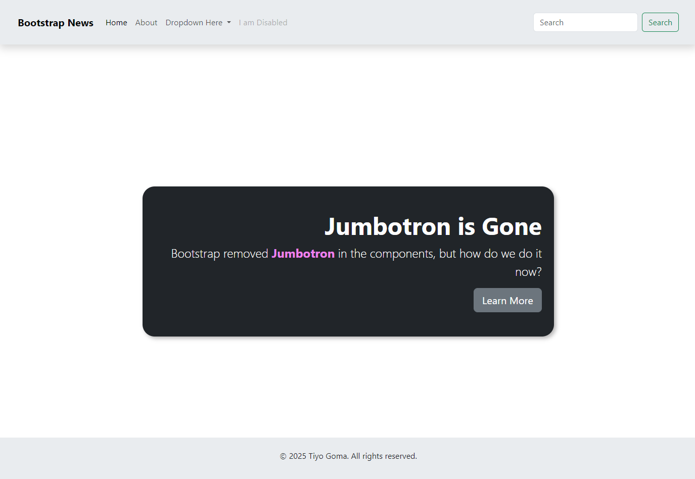

### **Assignment: Build a Simple Web Page with Bootstrap**

In this assignment, you will create a simple, responsive webpage using **Bootstrap**. You’ll practice using the grid system, components, and utilities to create a basic layout that adapts to different screen sizes.

#### **Estimated Time to Completion:** 1–2 hours  
#### **Level of Complexity:** Beginner  

---

### **Instructions**

1. Set up a new HTML file and link to **Bootstrap** either via CDN or by downloading the source files.  
2. Use the Bootstrap grid system to organize content.  
3. Incorporate at least two Bootstrap components (e.g., a navbar, button, or card).  
4. Use utility classes to adjust spacing and text alignment.

---

#### **Page Requirements (MVP)**

1. **Navigation Bar:**  
   - Create a simple navigation bar with links (e.g., Home, About, Contact).  
   - Ensure it’s responsive by using Bootstrap’s `navbar` component.

2. **Content Section:**  
   - Add a content section below the navbar with some text (e.g., a heading and a paragraph).  
   - Use the `container` class to center the content and make it look neat.

3. **Call to Action Button:**  
   - Add a button below the content with a label like "Learn More" or "Contact Us."  
   - Style the button using Bootstrap’s button classes (`btn`, `btn-primary`).

4. **Footer:**  
   - Add a footer at the bottom of the page with a simple copyright text.  
   - Use Bootstrap’s `text-center` class to center the text.

---

#### **Stretch Requirements**

1. **Explore and Add One More Component:**  
   - Explore the [Bootstrap Documentation](https://getbootstrap.com/docs/5.3/) and add another component of your choice (e.g., a card, alert, or icon).

2. **Responsiveness:**  
   - Test your webpage on different screen sizes (desktop, tablet, mobile) to make sure it adapts properly.

---

### **Evaluation Criteria & Learning Objectives**

- Understand the basics of Bootstrap’s grid system and how to structure a responsive layout.  
- Use common Bootstrap components like the navbar and button.  
- Learn to apply utility classes for spacing and text alignment.  
- Ensure the webpage is responsive and adapts to various screen sizes.

---

### **Submission Guidelines**

1. Save your completed HTML file as `lastname_firstname_simplepage.html`.  
2. Submit the file via the designated platform or email it to your instructor with the subject line: "Bootstrap Assignment: Simple Web Page."  
3. Include screenshots of your webpage on desktop and mobile views.

---

### **Important Notes**

- Use the [Bootstrap Documentation](https://getbootstrap.com/docs/5.3/) for guidance and to explore additional components.  
- Focus on getting the layout to look good on different screen sizes by using the responsive grid system.  
- Don’t worry too much about complex customizations—keep things simple and focus on core Bootstrap features.  

