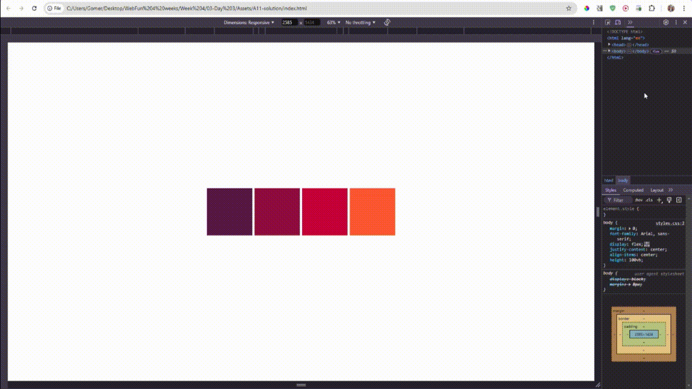

### **Assignment: Create Responsive Blocks with Media Queries**

In this assignment, you will create a webpage with responsive blocks that adapt their size, layout, and color based on the screen size. This will help you practice writing media queries and understanding their role in responsive design.

#### **Estimated Time to Completion:** 1–2 hours  
#### **Level of Complexity:** Intermediate (Beginner-friendly with guidance)  

---

### **Instructions**

1. Set up a new HTML file and link it to a CSS file. Use the provided starter code below for the HTML structure.  
2. Create a CSS file to style the blocks and include media queries for responsiveness.  
3. Use the following resolutions for your media queries:
   - **Phone:** Up to 480px
   - **Tablet:** 481px to 768px
   - **Desktop:** 769px and above  
4. Test your design on different screen sizes to ensure it adapts correctly.

---

#### **Starter Code**

```html
<!DOCTYPE html>
<html lang="en">
<head>
  <meta charset="UTF-8">
  <meta name="viewport" content="width=device-width, initial-scale=1.0">
  <title>Responsive Blocks</title>
  <link rel="stylesheet" href="styles.css">
</head>
<body>
  <div class="container">
    <div class="block block1"></div>
    <div class="block block2"></div>
    <div class="block block3"></div>
    <div class="block block4"></div>
  </div>
</body>
</html>
```

---

#### **Page Requirements (MVP)**



1. **Basic Layout:**  
   - Create a container with four blocks arranged horizontally for larger screens.  
   - Each block should have distinct background colors and be evenly spaced.  

2. **Responsive Behavior:**  
   - On **phones**, the blocks should stack vertically, be smaller, and have lighter colors.  
   - On **tablets**, the blocks should be arranged in two rows and have medium colors and size.  
   - On **desktops**, the blocks should be larger and more vibrant in color.

3. **Smooth Transitions:**  
   - Use the `transition` property to add smooth resizing and color changes when the screen is resized.

---

#### **Stretch Requirements**

1. **Hover Effects:**  
   - Add hover effects to the blocks to change their color or scale slightly.  

2. **Flexbox or Grid:**  
   - Use CSS Flexbox or Grid to control the block layout. This will help you practice modern layout techniques.  

3. **Custom Breakpoints:**  
   - Experiment with adding an additional custom breakpoint (e.g., for extra-large screens).

---

### **Evaluation Criteria & Learning Objectives**

- Write effective media queries to create a responsive design.  
- Ensure the layout and colors adapt dynamically to different screen sizes.  
- Use Flexbox or Grid to structure the layout.  
- Add smooth transitions for a polished design.  

---

### **Submission Guidelines**

1. Create a folder named `lastname_firstname_responsiveblocks` containing your HTML and CSS files.
2. Save your HTML file as `index.html` and your CSS file as `styles.css`.  
3. Compress the folder into a ZIP file named `lastname_firstname_responsiveblocks.zip`.  
4. Submit the ZIP file via the designated platform or email it to your instructor with the subject line: "Responsive Blocks Assignment."  
5. Include screenshots of your blocks on phone, tablet, and desktop views.

---

### **Important Notes**

- Focus on creating a visually distinct and functional layout for each screen size.  
- Use the `transition` property to make your design visually appealing.  
- Refer to the lesson on media queries for guidance and examples.  

---


